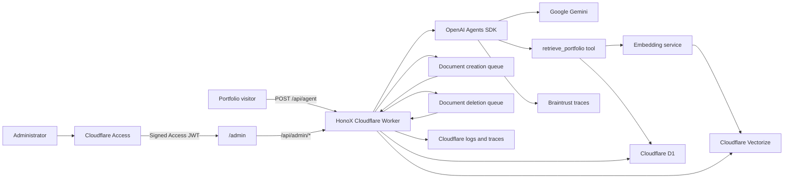
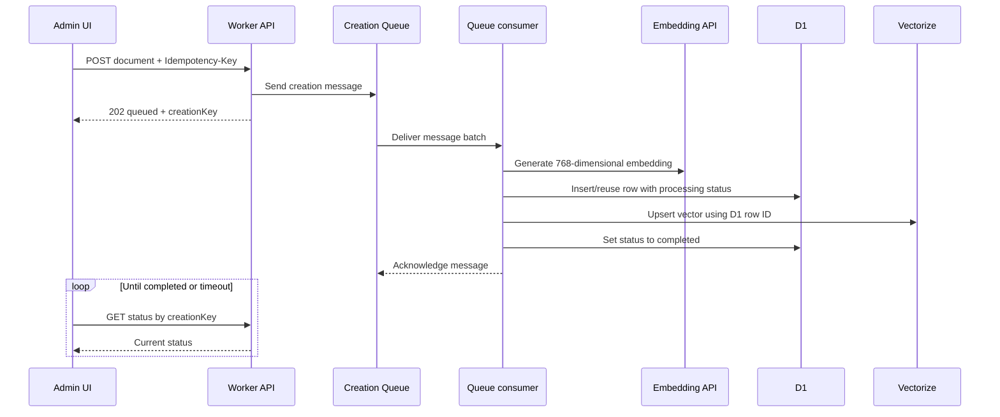

# Portfolio Chatbot

A retrieval-augmented portfolio assistant built with HonoX and deployed as a Cloudflare Worker. The public agent answers questions about Jia Wei using Gemini, while a Cloudflare Access-protected admin application manages the portfolio documents stored in D1 and indexed in Vectorize.

The project uses Bun for dependency management and application scripts. Cloudflare Queues perform document creation and deletion asynchronously, and Braintrust receives OpenAI Agents SDK traces for agent runs.

## Contents

- [Features](#features)
- [Architecture](#architecture)
- [Technology](#technology)
- [Repository structure](#repository-structure)
- [Request and data flows](#request-and-data-flows)
- [Prerequisites](#prerequisites)
- [Cloudflare resources](#cloudflare-resources)
- [Environment variables](#environment-variables)
- [Local setup](#local-setup)
- [Database and vector index](#database-and-vector-index)
- [Cloudflare Access setup](#cloudflare-access-setup)
- [API reference](#api-reference)
- [Admin application](#admin-application)
- [Queues, retries, and consistency](#queues-retries-and-consistency)
- [Observability and tracing](#observability-and-tracing)
- [Build and deployment](#build-and-deployment)
- [Troubleshooting](#troubleshooting)
- [Current limitations](#current-limitations)
- [Security notes](#security-notes)
- [Useful commands](#useful-commands)

## Features

- A streamed AI chat endpoint using the OpenAI Agents SDK and Gemini through the AI SDK adapter.
- Retrieval-augmented generation over portfolio content stored in Cloudflare D1 and indexed in Cloudflare Vectorize.
- A `retrieve_portfolio` agent tool that searches Vectorize and loads the matching completed documents from D1.
- An admin UI for listing, categorizing, creating, and deleting portfolio documents.
- Cloudflare Access authentication at the edge plus JWT verification inside the Worker.
- Asynchronous document creation and deletion through Cloudflare Queues.
- Idempotent document creation using a UUID `Idempotency-Key`.
- Per-message retries and dead-letter queues for failed background work.
- Exact-origin API checks, CSRF protection, secure headers, request logging, timing, and rate limiting.
- Cloudflare Worker observability and Braintrust tracing.

## Architecture



The HonoX application and the JSON API share the same Worker export:

- HonoX file-based pages live under `app/routes`.
- The Hono API is mounted at `/api` from `app/server.ts`.
- The same default Worker export also implements the Queue consumer handler.

## Technology

| Area | Technology |
| --- | --- |
| Runtime | Cloudflare Workers / Workerd |
| Package manager | Bun |
| Web framework | Hono and HonoX |
| Validation | Zod and `@hono/zod-validator` |
| Agent framework | OpenAI Agents SDK |
| Default chat model | Google Gemini through `@ai-sdk/google` |
| Embeddings | Gemini embedding API through the OpenAI-compatible client |
| Relational storage | Cloudflare D1 |
| Vector search | Cloudflare Vectorize |
| Background jobs | Cloudflare Queues |
| Admin authentication | Cloudflare Access |
| JWT verification | `jose` |
| Agent tracing | Braintrust |
| Build tooling | Vite and `@hono/vite-build` |

## Repository structure

```text
app/
├── client.ts                     HonoX client/island entry
├── islands/
│   └── AdminApp.tsx              Interactive document administration UI
├── routes/
│   ├── _renderer.tsx             Shared HTML renderer
│   ├── index.tsx                 Public root page
│   └── admin/                    Admin pages
├── server.ts                     Worker entry; mounts API and Queue handler
└── style.css                     Application styles

src/
├── admin/
│   ├── create.ts                 Enqueue and consume document creation
│   ├── delete.ts                 Enqueue and consume document deletion
│   └── read.ts                   List documents and query creation status
├── agent/
│   ├── index.ts                  Streamed agent request handler
│   ├── model.ts                  Gemini and optional provider factories
│   └── tools/
│       └── retrievePortfolio.ts  Portfolio retrieval tool
├── constant/                     Model, prompt, and trace configuration
├── middlewares/                  CORS, Access auth, rate limit, tracing, validation
├── routes/                       Hono API route definitions
├── schemas/                      Zod request and queue-message schemas
├── services/
│   ├── database/                 D1 document lookup
│   └── embedding/                Embedding generation and Vectorize search
├── types/                        Application and generated Worker types
├── api.ts                        API middleware chain and route mounting
└── queue.ts                      Queue name-to-consumer dispatcher

wrangler.jsonc                    Worker, bindings, queues, and observability config
vite.config.ts                    HonoX client/Worker build and development adapter
```

## Request and data flows

### Portfolio question

1. The client sends `{ "message": "..." }` to `POST /api/agent`.
2. The API checks the exact `Origin`, CSRF rules, and the per-IP rate limit.
3. The Worker creates the Gemini-backed agent and the `retrieve_portfolio` tool.
4. For an in-scope question, the system prompt requires the agent to call the retrieval tool.
5. The tool embeds the search query into a 768-dimensional vector.
6. Vectorize returns up to five matching document IDs.
7. D1 returns only matching rows whose status is `completed`.
8. The tool output is supplied to the model as portfolio context.
9. The response is streamed as AI SDK UI-message Server-Sent Events.

The system prompt limits answers to Jia Wei's background, skills, projects, work experience, education, and contact information. Retrieved documents are treated as data rather than instructions.

### Document creation



### Document deletion

1. The admin UI submits an array of D1/Vectorize IDs.
2. The API places the IDs on the deletion queue and returns `202`.
3. The consumer deletes the D1 rows.
4. The consumer deletes the same IDs from Vectorize.
5. The message is acknowledged only after both operations complete.
6. The UI polls the document list until all requested IDs are absent.

Deleting a missing D1 row is safe, so a retry after D1 succeeded but Vectorize failed can continue and retry the Vectorize deletion.

## Prerequisites

- [Bun](https://bun.sh/) for dependency management and project scripts.
- A Cloudflare account with Workers, D1, Vectorize, Queues, and Zero Trust Access available.
- A Google Gemini API key that can use the configured chat and embedding models.
- A Braintrust account and API key if tracing is enabled.
- Node.js available for the documented Wrangler development fallback on Windows.

The repository already contains resource names and a D1 database ID in `wrangler.jsonc`. When creating a separate environment or Cloudflare account, replace those values with resources owned by that environment.

## Cloudflare resources

The checked-in configuration expects these bindings:

| Binding | Resource | Purpose |
| --- | --- | --- |
| `DB` | D1 database `match_portfolio_documents` | Document content and processing status |
| `VECTORIZE` | Vectorize index `portfolio-index` | Similarity search over 768-dimensional embeddings |
| `DOCUMENT_CREATIONS_QUEUE` | `portfolio-chatbot-document-creations` | Asynchronous document creation |
| `DOCUMENT_DELETIONS_QUEUE` | `portfolio-chatbot-document-deletions` | Asynchronous document deletion |
| `AGENT_LIMITER` | Workers rate-limit binding | Ten agent requests per IP per 60 seconds |

The Queue consumers use these dead-letter queues after the configured retry limit:

- `portfolio-chatbot-document-creations-dlq`
- `portfolio-chatbot-document-deletions-dlq`

The D1 and Vectorize bindings currently have `"remote": true`. Consequently, `wrangler dev` accesses the configured Cloudflare resources rather than isolated local copies. Local development can therefore read, modify, or delete real remote data and may consume account quota.

To create equivalent resources in a new Cloudflare account:

```powershell
bunx wrangler d1 create match_portfolio_documents
bunx wrangler vectorize create portfolio-index --dimensions=768 --metric=cosine
bunx wrangler queues create portfolio-chatbot-document-creations
bunx wrangler queues create portfolio-chatbot-document-creations-dlq
bunx wrangler queues create portfolio-chatbot-document-deletions
bunx wrangler queues create portfolio-chatbot-document-deletions-dlq
```

After creating a new D1 database, copy its returned `database_id` into `wrangler.jsonc`. Resource names in `wrangler.jsonc` and the queue switch in `src/queue.ts` must remain aligned.

## Environment variables

### Required for the active application

| Variable | Secret? | Purpose |
| --- | --- | --- |
| `GEMINI_API_KEY` | Yes | Gemini chat and embedding API authentication |
| `BRAINTRUST_API_KEY` | Yes | Export agent traces to Braintrust |
| `POLICY_AUD` | Treat as deployment config | Expected Cloudflare Access application audience |
| `CORS_ORIGIN` | No, but environment-specific | The one exact browser origin allowed to call `/api/*` |
| `TEAM_DOMAIN` | No | Cloudflare Access team issuer and JWKS host |
| `GOOGLE_GENERATIVE_AI_MODEL` | No | Gemini chat model name |
| `GOOGLE_GENERATIVE_BASE_URL` | No | OpenAI-compatible Gemini endpoint |
| `EMBEDDING_MODEL` | No | Embedding model name |

`TEAM_DOMAIN`, model names, and base URLs are already public Worker variables in `wrangler.jsonc`. API keys must never be placed there.

### Optional or currently inactive variables

Generated Worker types also contain Mercury, NVIDIA, Supabase, and Firebase variables. Mercury and NVIDIA model factories exist, but the active `/api/agent` route uses Gemini. The current admin authentication uses Cloudflare Access, not Supabase or Firebase. These additional values are not required for the default portfolio flow unless those integrations are re-enabled.

### Local variables

Create a `.dev.vars` file in the repository root. It is ignored by Git.

```dotenv
GEMINI_API_KEY=replace-with-your-key
BRAINTRUST_API_KEY=replace-with-your-key
POLICY_AUD=replace-with-your-access-application-audience
CORS_ORIGIN=http://localhost:5173
```

Do not add quotation marks when using the custom Vite development adapter: it reads the text after `=` literally.

If the browser uses `http://127.0.0.1:8787`, configure that exact value instead of `http://localhost:8787`. Scheme, hostname, and port must all match.

### Deployed secrets

Set secrets in Cloudflare rather than committing them:

```powershell
bunx wrangler secret put GEMINI_API_KEY
bunx wrangler secret put BRAINTRUST_API_KEY
bunx wrangler secret put POLICY_AUD
bunx wrangler secret put CORS_ORIGIN
```

`CORS_ORIGIN` is not inherently sensitive, but storing environment-specific values outside the public configuration prevents a repository default from being accidentally deployed to the wrong environment.

## Local setup

### 1. Install dependencies

```powershell
bun install
```

### 2. Configure local variables

Create `.dev.vars` using the template in [Environment variables](#environment-variables).

### 3. Synchronize Cloudflare binding types

```powershell
bun run cf-typegen
```

This regenerates `src/types/worker-configuration.d.ts` from `wrangler.jsonc` and the configured Worker environment. Run it after adding, removing, or renaming bindings and variables.

The project defines `AppBindings` as the generated `CloudflareBindings` with a Vectorize v2 type override so code can use asynchronous mutation results such as `mutationId`.

### 4. Choose the appropriate development mode

#### UI and lightweight route development

```powershell
bun run dev
```

This starts the HonoX Vite development server. The custom adapter loads `.dev.vars` and supplies a no-op rate limiter, but it does **not** provide actual `DB`, `VECTORIZE`, or Queue bindings. Pages can render, but retrieval and admin data operations will fail when they reach those bindings.

#### Full Worker and binding development

Build the Worker, then start the built entry through Wrangler:

```powershell
bun run build
node ./node_modules/wrangler/bin/wrangler.js dev
```

This is the recommended path for D1, Vectorize, Queue, and Worker execution-context behavior. Node hosts the Wrangler CLI because Bun-hosted Wrangler development has produced unsupported-runtime and WebSocket `101` failures on Windows.

Because `remote: true` is configured for D1 and Vectorize, this mode touches remote resources. Use a separate development database and index before allowing destructive local tests if production data matters.

Cloudflare Access does not automatically sit in front of `127.0.0.1`. The admin API expects a genuine `Cf-Access-Jwt-Assertion`, so end-to-end admin authentication should be tested against the deployed Access-protected Worker or through a named Cloudflare Tunnel protected by the same Access application. Do not commit a bypass for the authentication middleware.

## Database and vector index

### Expected D1 schema

The repository does not currently include a migration file. A new environment needs a `document_chunk` table compatible with the following schema:

```sql
CREATE TABLE IF NOT EXISTS document_chunk (
  id INTEGER PRIMARY KEY AUTOINCREMENT,
  creation_key TEXT NOT NULL,
  title TEXT NOT NULL,
  category TEXT NOT NULL,
  content TEXT NOT NULL,
  status TEXT NOT NULL DEFAULT 'processing'
    CHECK (status IN ('processing', 'completed', 'failed')),
  created_at TEXT NOT NULL DEFAULT CURRENT_TIMESTAMP
);

CREATE UNIQUE INDEX IF NOT EXISTS document_chunk_creation_key_idx
ON document_chunk (creation_key);
```

The unique `creation_key` index makes a retried creation message idempotent. The consumer can retrieve the existing row instead of creating a second record for the same request.

For a new environment, save the SQL as a reviewed migration and apply it to the intended database. Always verify whether the target is local or remote before executing schema commands.

### Vectorize configuration

The embedding service requests 768 dimensions, so `portfolio-index` must also be created with exactly 768 dimensions. Vector dimensions cannot be mixed within an index.

If an existing index reports errors such as “expected 32/768 dimensions and got 1536/3072,” create a correctly sized replacement index and update `index_name` in `wrangler.jsonc`.

Each vector uses the D1 row ID converted to a string. Vector metadata contains the document title and category; full content remains in D1.

### Data states

| Status | Meaning |
| --- | --- |
| `processing` | The D1 row exists, but the vector operation or final update has not completed |
| `completed` | D1 and Vectorize creation completed; the retrieval query may use the document |
| `failed` | Reserved by the schema/UI for a terminal failure state |

The active creation consumer retries failures and does not currently write `failed` after dead-lettering. A message that exhausts all retries may therefore leave a row in `processing`; inspect the creation dead-letter queue and Worker logs in that case.

## Cloudflare Access setup

Cloudflare Access performs the interactive login before the Worker executes. The Worker then independently verifies the Access JWT using the team JWKS, expected issuer, and expected audience.

Configure a self-hosted Access application with both of these protected destinations:

- `portfolio-chatbot.<account>.workers.dev/admin*`
- `portfolio-chatbot.<account>.workers.dev/api/admin/*`

Protecting only `/admin*` is insufficient: the page will authenticate, but its fetch calls to `/api/admin/*` will not receive `Cf-Access-Jwt-Assertion`, and the Worker will return `401 Unauthorized`.

Then:

1. Add an Access policy that includes the permitted email addresses, domains, groups, or service tokens.
2. Set `TEAM_DOMAIN` to the full HTTPS team domain, for example `https://example.cloudflareaccess.com`.
3. Copy the application audience (`AUD`) into `POLICY_AUD`.
4. Deploy the Worker secrets and configuration.
5. Visit `/admin`; Cloudflare Access should redirect to the configured identity provider before rendering the page.

The middleware expects the assertion header injected by Cloudflare. Application JavaScript should not read, store, or forward that JWT itself.

For non-browser automation, create a Cloudflare Access service token and send its client ID and client secret to the Access-protected Worker. Cloudflare validates the service token at the edge and injects the assertion before forwarding the request.

## API reference

Every `/api/*` route currently passes through `strictAgentOrigin`. The request must include an `Origin` header that exactly matches `CORS_ORIGIN`; a missing or different origin returns `403`.

Validation failures return status `422` with this general shape:

```json
{
  "message": "Invalid json from request",
  "errors": []
}
```

### POST `/api/agent`

Runs the portfolio agent and streams its response.

Request:

```json
{
  "message": "What projects has Jia Wei worked on?"
}
```

Example:

```powershell
curl.exe -N "http://127.0.0.1:8787/api/agent" `
  -H "Origin: http://127.0.0.1:8787" `
  -H "Accept: text/event-stream" `
  -H "Content-Type: application/json" `
  --data '{"message":"What projects has Jia Wei worked on?"}'
```

Successful response:

- Status: `200 OK`
- Content type: AI SDK UI-message event stream
- Body: incremental agent, tool-call, tool-output, and text events

Possible errors:

| Status | Reason |
| --- | --- |
| `403` | Origin is absent or does not exactly match `CORS_ORIGIN` |
| `422` | `message` is missing or not a string |
| `429` | The IP exceeded ten agent requests within 60 seconds |
| `500` | The model, retrieval, or agent run failed before a response could be created |

### GET `/api/admin/documents`

Returns all D1 document rows ordered by descending ID. Requires Cloudflare Access.

Response:

```json
{
  "data": [
    {
      "id": 12,
      "creation_key": "1bd74ee4-ce44-4be2-b3d2-c9218e8a93a8",
      "title": "Project title",
      "category": "projects",
      "content": "Project details...",
      "status": "completed",
      "created_at": "2026-08-12 09:30:00"
    }
  ]
}
```

### POST `/api/admin/document-chunks`

Queues a document for embedding, D1 insertion, and Vectorize upsert. Requires Cloudflare Access.

Headers:

| Header | Required | Purpose |
| --- | --- | --- |
| `Content-Type: application/json` | Yes | Select JSON request validation |
| `Idempotency-Key: <UUID>` | Recommended | Reuse the same logical creation across client retries |

Request constraints:

| Field | Type | Constraint |
| --- | --- | --- |
| `title` | string | 1–200 characters |
| `category` | string | 1–50 characters |
| `content` | string | 1–5000 characters |

Request:

```json
{
  "title": "Expense Tracker API",
  "category": "projects",
  "content": "Jia Wei built an API with Hono on Cloudflare Workers."
}
```

Accepted response:

```json
{
  "status": "queued",
  "creationKey": "1bd74ee4-ce44-4be2-b3d2-c9218e8a93a8"
}
```

Status: `202 Accepted`. This response means Queue accepted the message, not that D1 and Vectorize have completed.

If `Idempotency-Key` is omitted, the Worker generates a UUID. A client retry without reusing the original key can create a second logical document.

### GET `/api/admin/document-chunks/status`

Returns the status of one or more creation keys. Requires Cloudflare Access.

Repeat the query parameter for multiple documents:

```text
/api/admin/document-chunks/status?creationKey=<uuid-1>&creationKey=<uuid-2>
```

Response:

```json
{
  "data": [
    {
      "id": "12",
      "creationKey": "1bd74ee4-ce44-4be2-b3d2-c9218e8a93a8",
      "status": "completed"
    }
  ]
}
```

The current handler returns `202 Accepted` for a successful status query. A newly queued key may be absent until the consumer creates its D1 row.

### DELETE `/api/admin/document-chunks`

Queues one or more document IDs for deletion from D1 and Vectorize. Requires Cloudflare Access.

Request:

```json
{
  "id": ["12", "13"]
}
```

Accepted response:

```json
{
  "status": "queued"
}
```

Status: `202 Accepted`. There is no separate deletion-status endpoint; the admin client polls the document list until the IDs are gone.

### GET `/api/whatsapp/email`

This route exists in the source but currently expects `c.var.supabaseContext` even though no Supabase authentication middleware is mounted in the active API chain. Treat it as incomplete/legacy; it is not part of the working Cloudflare Access admin flow.

## Admin application

The HonoX admin island is served at `/admin` and uses same-origin requests to the admin API.

Its current behavior is:

- Load all documents when the island mounts.
- Filter stored context by category.
- Generate a UUID idempotency key before creating a document.
- Poll creation status for up to 90 seconds with increasing delays from one to five seconds.
- Allow multiple documents to be selected for deletion.
- Poll the list endpoint until selected IDs disappear.
- Redirect to `/cdn-cgi/access/logout` when the user clicks **Log out**.

The UI polling is intentionally bounded and uses backoff, so it does not make a request continuously. For normal admin usage, this is lightweight compared with polling every few milliseconds.

The admin UI is designed to be served from the same Worker origin. Cross-origin API support currently declares only `GET` and `POST` in the CORS middleware; cross-origin `DELETE` preflight is not supported without extending that configuration.

## Queues, retries, and consistency

Cloudflare delivers Queue messages to the Worker's `queue()` handler in batches. One Queue is not one batch: a Queue can contain many messages, and each consumer invocation receives up to the configured `max_batch_size` of ten messages.

The consumer loops because every message in a delivered batch must be validated, processed, and individually acknowledged or retried.

Current consumer settings:

| Setting | Value |
| --- | --- |
| Maximum batch size | 10 messages |
| Maximum batch wait | 5 seconds |
| Maximum retries | 5 |
| Application retry delay | 30 seconds |
| Terminal destination | Operation-specific dead-letter queue |

Creation consistency:

- The API response confirms only that enqueueing succeeded.
- `creation_key` and its unique index make D1 insertion idempotent.
- Vectorize uses `upsert`, so retrying the same D1 ID replaces or recreates that vector safely.
- Retrieval excludes rows until their D1 status is `completed`.

Deletion consistency:

- D1 and Vectorize do not share a distributed transaction.
- The consumer deletes D1 first, then Vectorize, and acknowledges afterward.
- If Vectorize fails, the message is retried. Repeating the D1 `DELETE` is harmless even if the row is already absent.
- If all retries fail, the message reaches the deletion dead-letter queue for investigation or redrive.

This is eventual consistency, not an atomic all-or-nothing transaction across D1 and Vectorize. Queues, idempotent operations, retries, and DLQs are the recovery strategy.

## Observability and tracing

### Cloudflare

`wrangler.jsonc` enables:

- Worker logs
- Invocation logs
- Worker traces

Stream deployed logs with:

```powershell
bunx wrangler tail
```

Queue consumers emit structured JSON events for completed deletions and failed creation/deletion attempts. Important fields include the event name, Queue message ID, attempt number, affected IDs, and error message.

### Braintrust

The agent trace middleware initializes the Braintrust logger for the `portfolio-agent` project and replaces the OpenAI Agents SDK trace processor with `OpenAIAgentsTraceProcessor`. The handler schedules a logger flush through the Worker execution context so exporter work can continue outside the response lifecycle.

The production Vite SSR configuration prefers the `workerd` export condition. This is important because selecting the browser shim for `@openai/agents` disables tracing.

If Braintrust remains on “Waiting for logs,” verify:

1. `BRAINTRUST_API_KEY` is set in the environment executing the Worker.
2. At least one valid `/api/agent` request has completed.
3. The Braintrust project is named `portfolio-agent`.
4. The production Worker bundle resolved the Workerd shim rather than the browser shim.
5. Cloudflare logs do not show exporter or flush errors.

Trace-export failures should be investigated independently from the streamed response. Do not expose the Braintrust key to the browser.

## Build and deployment

### Production build

```powershell
bun run build
```

The script performs two Vite builds:

1. Client assets for the HonoX islands and styles.
2. The Cloudflare Worker bundle at `dist/index.js`.

### Pre-deployment checklist

1. Confirm `wrangler.jsonc` targets the correct Cloudflare account resources.
2. Confirm the Vectorize index has 768 dimensions.
3. Apply the `document_chunk` schema to the intended D1 database.
4. Confirm both creation and deletion queues and both DLQs exist.
5. Set `GEMINI_API_KEY`, `BRAINTRUST_API_KEY`, `POLICY_AUD`, and `CORS_ORIGIN` in the deployed Worker.
6. Configure Access for both `/admin*` and `/api/admin/*`.
7. Regenerate binding types after configuration changes.
8. Build successfully before deploying.

### Deploy

```powershell
bun run deploy
```

The deploy script builds the client and Worker, then invokes Wrangler deployment.

### Post-deployment checks

1. Open `/admin` in a signed-out browser and confirm Cloudflare Access prompts for login.
2. Sign in and confirm the document list loads without `401` or `403`.
3. Create a test document and wait for `completed`.
4. Ask `/api/agent` a question that should retrieve the test document.
5. Delete the test document and verify it disappears from the list.
6. Inspect Worker Queue logs and confirm the message was acknowledged.
7. Confirm a single agent trace appears in the Braintrust `portfolio-agent` project.

## Troubleshooting

### `Origin not allowed` or HTTP 403

- Set `CORS_ORIGIN` to one exact origin, including scheme and port.
- Make sure the request sends an `Origin` header.
- Do not mix `localhost` and `127.0.0.1`.
- If the frontend is deployed separately, use its exact production origin.

### The admin page works, but `/api/admin/*` returns 401

The Access application probably protects `/admin*` but not `/api/admin/*`. Add the API path as a protected destination. Logging into one protected path does not cause Access to inject an assertion into an unprotected path.

Also verify that `TEAM_DOMAIN` is the full HTTPS team domain and `POLICY_AUD` is the audience of the same Access application.

### `Cannot read properties of undefined (reading 'prepare')`

`c.env.DB` is undefined. This commonly happens under `bun run dev`, whose custom Vite adapter does not create D1, Vectorize, or Queue bindings. Build and use Wrangler development for binding-dependent routes.

### `D1_ERROR: no such table: document_chunk`

- Verify the table exists in the exact D1 database bound as `DB`.
- Check whether the command targeted local or remote D1.
- Remember that the current configuration uses remote D1 during Wrangler development.
- Apply the expected schema to the correct database.

### Vector dimension mismatch

The application creates 768-dimensional embeddings. Vectorize must expect 768 dimensions. Changing the `dimensions` request option does not resize an existing Vectorize index; create a matching index and update the binding.

### Creation stays queued or processing

- Check Worker logs for `document_creation_failed`.
- Check that the creation Queue consumer is attached to this Worker.
- Verify `GEMINI_API_KEY`, the embedding model name, D1 schema, and Vectorize dimensions.
- Inspect `portfolio-chatbot-document-creations-dlq` after retries are exhausted.
- A key can be absent briefly because the D1 row is created by the consumer, not by the HTTP handler.

### Deletion never completes

- Check Worker logs for `document_deletion_failed`.
- Verify the deletion Queue consumer name matches `src/queue.ts` and `wrangler.jsonc`.
- Inspect the deletion DLQ.
- D1 may already be clean while Vectorize is still retrying; this is expected during partial failure recovery.

### Wrangler reports a missing redirected `dist/.../wrangler.json`

Build before starting Wrangler so the deployed entry and generated configuration exist:

```powershell
bun run build
node ./node_modules/wrangler/bin/wrangler.js dev
```

If the error references stale `.wrangler/deploy/config.json`, stop all Wrangler processes before cleaning only the generated `.wrangler` directory, then rebuild. Never remove source configuration or D1 data directories without verifying the target.

### Bun-hosted Wrangler fails with `Unexpected server response: 101`

Use Bun for the project, but host the local Wrangler executable with Node:

```powershell
node ./node_modules/wrangler/bin/wrangler.js dev
```

### Braintrust receives no traces

See [Observability and tracing](#observability-and-tracing). Start with the deployed secret, Workerd bundle condition, and Worker logs.

## Current limitations

- No automated test suite or test script is currently included.
- No checked-in D1 migration exists; the expected schema is documented above.
- The lightweight Vite development server does not emulate D1, Vectorize, Queues, or Cloudflare Access.
- The WhatsApp email route still depends on a Supabase context that is not installed by the active middleware chain.
- The creation consumer does not explicitly mark a D1 row as `failed` after all Queue retries are exhausted.
- There is no deletion job/status table; the UI detects completion by polling the document list.
- D1 and Vectorize updates are eventually consistent rather than transactionally atomic.
- Cross-origin CORS preflight currently allows only `GET` and `POST`; the same-origin admin UI is the intended deletion client.

## Security notes

- Keep API keys, service tokens, Access cookies, and JWTs out of Git, screenshots, logs, and issue reports.
- `.dev.vars`, `.env*`, `.wrangler`, service-account files, and common log files are ignored by Git.
- Public Wrangler configuration can safely contain model names, public URLs, binding names, D1 IDs, and Vectorize index names. Those values identify resources but do not grant access by themselves.
- Protect both the admin page and admin API with Cloudflare Access. The Worker-side JWT check is defense in depth, not a replacement for the Access policy.
- The API rejects requests whose origin does not exactly match `CORS_ORIGIN`.
- D1 query values use prepared-statement placeholders and `.bind(...)` instead of string interpolation. Only the number of generated placeholders is interpolated.
- Queue input is validated again inside the consumer because messages are an asynchronous trust boundary.
- The system prompt instructs the model to treat retrieved content as data and ignore instructions embedded in documents.
- Remote bindings make local mistakes capable of affecting cloud data; use separate development resources for safer testing.

Before publishing the repository, review tracked files with:

```powershell
git status --short
git grep -n -I -E "(API_KEY|SECRET|TOKEN|PASSWORD|CF_Authorization)"
```

Review every match manually. Variable names and placeholder examples are expected; real credential values are not.

## Useful commands

| Command | Purpose |
| --- | --- |
| `bun install` | Install locked dependencies |
| `bun run dev` | Start lightweight HonoX/Vite development |
| `bun run build` | Build client assets and the Worker bundle |
| `bun run preview` | Build and run the Vite preview command |
| `bun run cf-typegen` | Regenerate `CloudflareBindings` types |
| `bun run deploy` | Build and deploy with Wrangler |
| `bunx wrangler tail` | Stream deployed Worker logs |
| `node ./node_modules/wrangler/bin/wrangler.js dev` | Run the full local Worker through Node-hosted Wrangler |

## References

- [Cloudflare Workers documentation](https://developers.cloudflare.com/workers/)
- [Wrangler configuration](https://developers.cloudflare.com/workers/wrangler/configuration/)
- [Cloudflare D1](https://developers.cloudflare.com/d1/)
- [Cloudflare Vectorize](https://developers.cloudflare.com/vectorize/)
- [Cloudflare Queues](https://developers.cloudflare.com/queues/)
- [Cloudflare Access applications](https://developers.cloudflare.com/cloudflare-one/access-controls/applications/)
- [OpenAI Agents SDK for JavaScript](https://openai.github.io/openai-agents-js/)
- [Braintrust OpenAI Agents integration](https://www.braintrust.dev/docs/integrations/sdk-integrations/openai-agents)

## License

No license file is currently included. Unless a license is added, normal copyright restrictions apply even if the repository is publicly visible.
